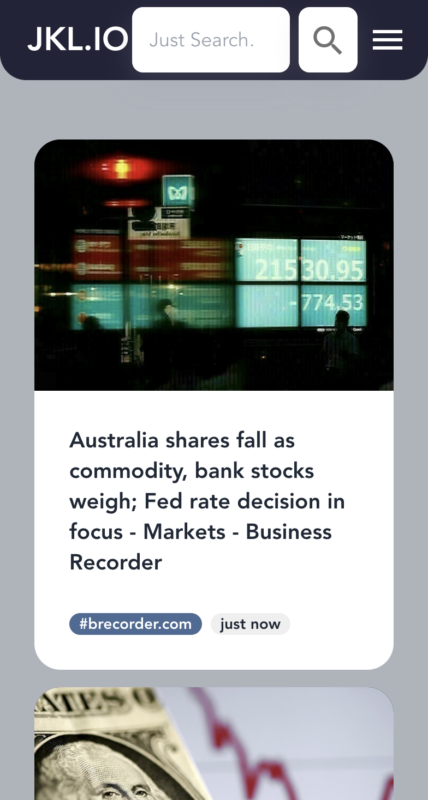

# Desktop Home Page Implementation

 

## Weds, Sep 24 2022 - version 3.0

- autocomplete (without implementation of API)

## Weds, Sep 21 2022 - version 2.1

- responsive to mobile

    

## Weds, Sep 15 2022 - version 2.0

- Changed color theme
- Masonry layout Implementation

## Mon, Sep 12 2022 - version 1.2

- Changed hover on news card
- Tried Google UI theme color
- Added footer

## Fri, Sep 9 2022 - version 1.1

- Freezed navigation bar
- Adjusted news cards layout
- Added time stamp
- Fixed the text display

## Fri, Sep 9 2022 - version 1.0

Implemented the layout of the main page, and imported text and images for the news cards (updated in real time using the Gigablast API).