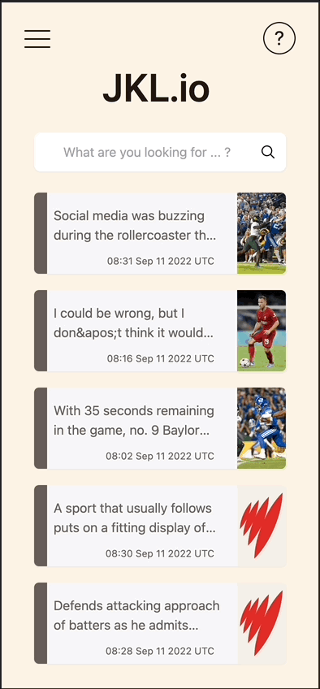

# JKL Mobile - MainScreen

## Color Pallet

```
  //=========== OLD COLOR SCHEME (SEPIA)
  //=========== main          :'#FAF2E5',
  //=========== card          :'#F6F7F9',
  //=========== text          :'#201714',
  //=========== subtext       :'#665D58',
  //=========== bar           :"#7E7976",
  // NEW COLOR SCHEME
  main            : '#90989F',
  card            : '#FBFDFB',
  text            : '#201714',
  subtext         : '#665D58',
  bar             : '#2B4773',
  logo            : '#FBFDFB',
  panelLogo_left  : '#FBFDFB',
  panelLogo_right : '#FBFDFB',
  panel_left      : '#2B4773',
  panel_right     : '#2B4773',
```

## 2022.09.29 Update


## 2022.09.28 Update


## 2022.09.14 Update 


## 2022.09.11 Update


## 2022.09.10 Update


## 2022.09.09 Update



## 2022.09.08


